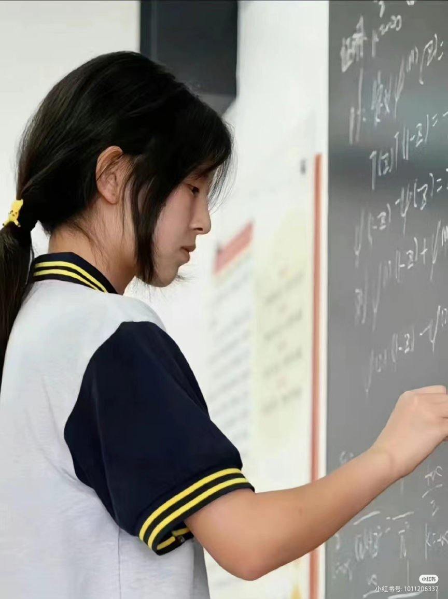
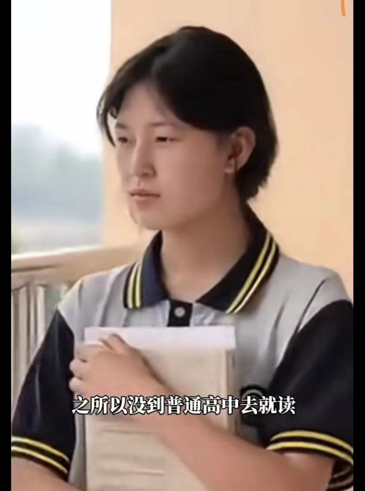

# 📰 新闻资讯
    
中专女生爆冷拿下数学竞赛全球12名

    

    知识改变命运。来自江苏淮安的17岁女孩获喜讯，以全球排名12的成绩入围数学竞赛决赛，成为赛事历来首个打进决赛的中专生。
    

    

    17岁、中专生、服装设计专业，当姜萍身上的多个标签与数学竞赛联系在一起，让她瞬间成了坊间那个“别人家的孩子”。北京时间6月13日，2024阿里巴巴全球数学竞赛(简称“阿里数赛”)公布决赛名单，
    801人成功晋级。其中，江苏省涟水中等专业学校服装设计专业的17岁女生姜萍拿到了93分的好成绩，全球排名12，成为唯一闯进全球30名的女性选手。
    

    

    

    阿里数赛由阿里巴巴公益、达摩院举办，决赛将于北京时间6月22日举行。贝壳财经记者浏览名单发现，除了姜萍，决赛名单上的大部分参赛者均来自北京大学、剑桥大学、麻省理工学院等知名高校。值得一提的是，毕业于江苏大学并“挖”到姜萍这匹千里马的指导老师王闰秋也在其列，排名125，同样入围决赛。
    

    

    

    在姜萍获大量网友关注的同时，庞众望，这个在苦难中昂扬的少年重新回到了大众视野。如今，他已经在攻读博士期间取得斐然的科研成就。与此同时，“数学天才少女”姜萍仍然身处流量漩涡。铺天盖地的杂音让不少网友担心，姜萍会自此迷失前行的方向。同为享有流量盛宴的“天才”，庞众望的成长似乎可以给担忧姜萍的网友们喂下一颗定心丸。真正源于内心渴望的梦想，不会被流量裹挟；真正出于内心渴望的道路，不会被流量绑架。当信息爆炸时代的目光凝聚于一人身上，其压力可想而知。在舆论的聚光灯下，一切微小的举动都被放大，一切若有似无的细节都遭人联想。大众的凝视，早已脱离对一个真实个体的关注，而是虚构出了一个半真半假的形象，追捧或贬低着一个被塑造出的符号。这个符号，被一部分人视为天才的典范，被另一部分人视为教育的失败。作为符号内核的姜萍，却处于不被看见的黑色地带中。对于姜萍来说，将本我从流量符号中剥离开来，并不是一件难事。她能够清晰地认识到自己的价值和目标，不被外界的标签和期待所左右。姜萍此前接受采访时曾说，自己更热爱服装：“如果学习服装设计是我的planA，那探索数学世界便是我的planB，希望我的planB也能被看见。”细斟内心，观照自我。
    

    # 💬评论
    
《撕去标签，看见真我：对姜萍事件中媒体角色的审视》

    
文马忠成

    

    在数字时代的浪潮中，每一次键盘的敲击都可能掀起舆论的风浪。姜萍，这位在世界数学竞赛中脱颖而出的17岁少女，以其非比寻常的成就，成为公众讨论的焦点。然而，令人遗憾的是，她的光辉并未完全照亮前行的路途，反而被“中专生”这一标签的阴影所笼罩。在这一过程中，自媒体和中央级媒体的表现，无疑加剧了这一标签的影响力，使得姜萍的个人成就被置于一个更为复杂的语境之中。
    

    

    自媒体，作为信息传播的前沿阵地，常常以其敏锐的嗅觉捕捉社会热点。然而，在追逐流量和热度的同时，一些自媒体往往忽视了报道的深度与客观性。在姜萍事件中，部分自媒体过度强调“中专生”的身份，以此作为吸引眼球的噱头，却在无形中加深了公众对这一群体的刻板印象。这种做法，不仅未能全面展现姜萍的努力与才华，更可能在社会上播下不公与偏见的种子。
    

    

    

    与此同时，中央级媒体作为国家声音的代表，其在事件中的角色同样引人注目。在追求权威与公正的同时，中央级媒体也应警惕标签化的风险。在姜萍事件中，如果中央级媒体未能及时纠正或平衡自媒体带来的标签化倾向，那么其所传递的信息就可能被误解为对“中专生”群体能力的默认限制。这种情况下，中央级媒体的责任在于不仅要传递信息，更要引导公众正确理解个体与群体之间的关系，避免标签化思维的蔓延。
    

    

    姜萍的故事，不仅仅是一个关于数学才能的展现，更是一个关于打破偏见和标签束缚的挑战。自媒体和中央级媒体，作为社会舆论的重要塑造者，有责任超越表面的标签，深入挖掘每个人背后的故事，展现出多元而真实的世界。在这个过程中，媒体应当成为推动社会进步不可或缺的力量，而非简单的信息搬运工。
    

    

    

    最终，我们期待的是一个更加包容和平等的社会环境，一个能够真正认识到每个人独特价值的世界。在这样的世界里，无论是自媒体还是中央级媒体，都将致力于传递正能量，激发社会的创造力和潜能，让每个人的光芒不再被无谓的标签所遮挡。
    

